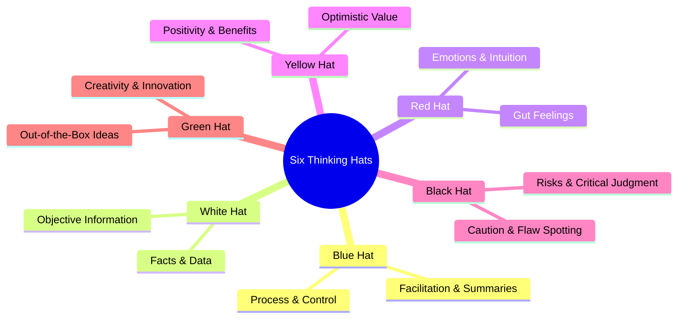
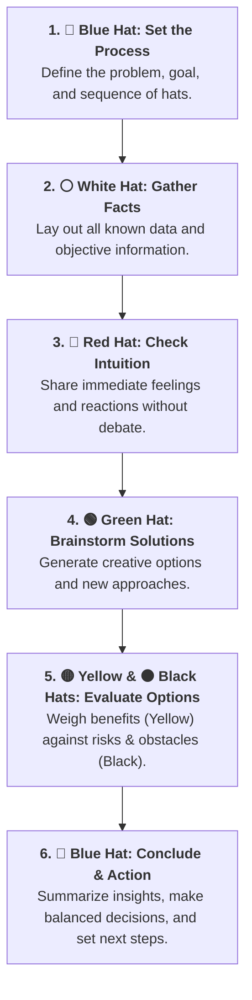

# The Six Thinking Hats Technique

## Overview

The **Six Thinking Hats** is a structured decision-making and problem-solving framework developed by Edward de Bono. It encourages parallel thinking by prompting individuals and teams to view a problem from six distinct perspectives—represented by different colored hats—one at a time.

This structured approach balances facts with feelings, creativity with caution, and logic with imagination, leading to well-rounded, thoughtful decisions.

---

## The Six Hats Breakdown

---

## Detailed Explanation of Each Hat

| Hat               | Focus Area                  | Core Role & Mindset                                                                     | Key Questions Asked                                                    |
| ----------------- | --------------------------- | --------------------------------------------------------------------------------------- | ---------------------------------------------------------------------- |
| **🔵 Blue Hat**   | **Control & Process**       | Manages the thinking session, sets the agenda, organizes outputs, and enforces rules.   | _What is the goal? Which hat do we wear next? What have we decided?_   |
| **⚪ White Hat**  | **Facts & Data**            | Gathers objective, verifiable data and highlights missing information without judgment. | _What information do we have? What facts are missing?_                 |
| **🔴 Red Hat**    | **Emotions & Intuition**    | Expresses gut feelings, fears, and emotional reactions without needing justification.   | _How do we feel about this? What does our intuition say?_              |
| **🟡 Yellow Hat** | **Benefits & Optimism**     | Explores positive outcomes, value, feasibility, and best-case scenarios.                | _What are the advantages? How can this work?_                          |
| **⚫ Black Hat**  | **Risks & Caution**         | Evaluates potential failures, weaknesses, regulatory roadblocks, and hazards.           | _What could go wrong? What are the risks and flaws?_                   |
| **🟢 Green Hat**  | **Creativity & Innovation** | Brainstorms alternative solutions, fresh concepts, and lateral thinking options.        | _What are new ways to solve this? What if we tried something radical?_ |

---

## Practical Implementation Workflow

To apply the technique effectively, wear **one hat at a time as a team**. Switching perspectives simultaneously prevents arguments and keeps discussions focused.

---

## Key Benefits

- **Eliminates Ego & Friction:** Everyone looks in the same direction at the same time, turning debates into collaborative exploration.
- **Prevents Blind Spots:** Ensures risk management (Black) doesn't crush creativity (Green), and emotional gut checks (Red) aren't ignored by pure data (White).
- **Faster, Higher-Quality Decisions:** Covers all angles upfront, reducing post-decision regret and systemic rework.

`

<ElicitationsGroup message="Where would you like to go next with these problem-solving techniques?">
  <Elicitation label="Create a master reference sheet combining 5 Whys, Pareto, and 6 Hats" query="Create a single consolidated master markdown cheat sheet that combines the 5 Whys, Pareto Principle, and Six Thinking Hats techniques."/>
  <Elicitation label="See a real-world case study applying all three methods together" query="Show me a step-by-step case study of a project team using 5 Whys, Pareto Principle, and Six Thinking Hats together to solve a major deadline issue."/>
</ElicitationsGroup>
